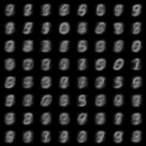

# TinyFlow

A tiny (120k parameters) flow matching model for generating MNIST digits.



## Dependencies

The only dependencies are [PyTorch](https://pytorch.org/) (including Torchvision) and [Pillow](https://python-pillow.org/).

## How to run

To run the model:
```bash
python main.py
```
It will download the MNIST dataset if it's not already present.\
Once the model is trained, it will save the model weights to `model.pt`.\
After training `sampling.gif` will be saved, showing how the model generates MNIST digits.

## Settings

The following command line arguments are available:
- `--embedding-dim`: Token embedding dimension (default: 96)
- `--depth`: Number of times the shared transformer block is applied (default: 8)
- `--heads`: Number of attention heads, must divide `--embedding-dim` (default: 8)
- `--patch-size`: Patch size, must divide 28 (default: 4)
- `--train-steps`: Number of training steps (default: 64000)
- `--batch-size`: Batch size (default: 512)
- `--lr`: Learning rate (default: 3e-3)
- `--warmup`: Warmup fraction (default: 0.05)
- `--ema`: Exponential moving average decay (default: 0.999)
- `--seed`: Random seed (default: 0)
- `--sample-steps`: Number of sampling steps (default: 200)
- `--gif`: Output GIF filename (default: `sampling.gif`)
- `--ckpt`: Checkpoint filename (default: `model.pt`)
- `--skip-train`: Skip training and only sample from the model (default: False). The model options are read from the checkpoint, so `--embedding-dim`, `--depth`, `--heads` and `--patch-size` are ignored.

So, for example, you can run:
```bash
python main.py --train-steps 10000 --batch-size 256 --lr 1e-3
```
or
```bash
python main.py --skip-train --ckpt model.pt --gif my_sampling.gif --sample-steps 500
```

## Architecture

Some notable architectural choices:
- The model is a vision transformer.
- Given the input $x_t$, the model is trained to directly predict $x_1$, rather than predicting the velocity field $v_t$ of the flow.
- The model does _not_ see $t$, it only sees $x_t$. The noise level has to be inferred from the input itself.
- A single transformer block is applied 8 times with shared weights.
- $t$ is drawn from a logit-normal distribution, $t = \sigma(z)$ where $\sigma$ is the sigmoid function and $z \sim \mathcal{N}(0, 1)$ is standard normally distributed.
- An exponential moving average of the model weights is maintained during training and used for sampling.
- Self rolled attention is used as this is faster than the build in `scaled_dot_product_attention` in this minimal example.